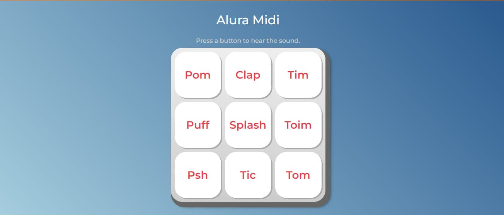

# Alura Midi

Project developed in the STARTING IN PROGRAMMING course - [Alura](https://www.alura.com.br/formacao-programacao) - [Certificate](https://drive.google.com/file/d/1rgvCQ9fEeQ2nFhw6UTWae6TqlqTnG3m8/view).

The project uses JavaScript to play a instrument song when a button is pressed.

[Project webpage](https://kelwynoliveira.github.io/aluramidi/)

